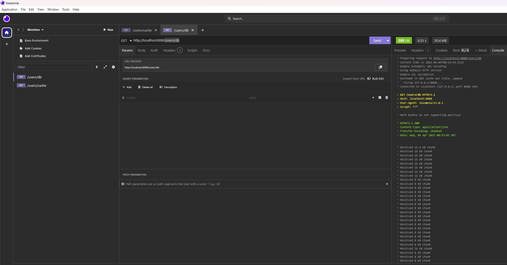
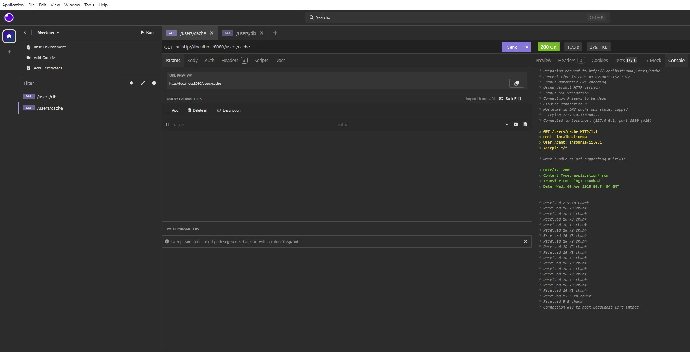
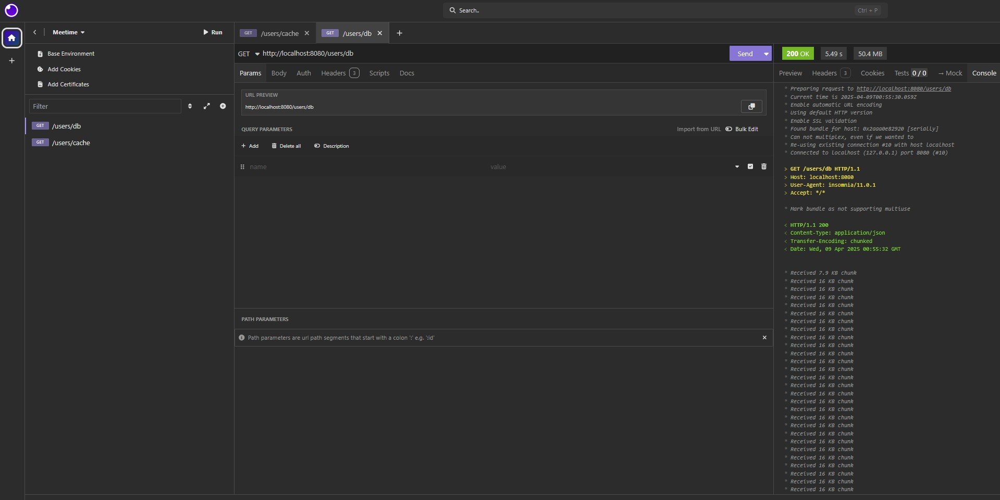
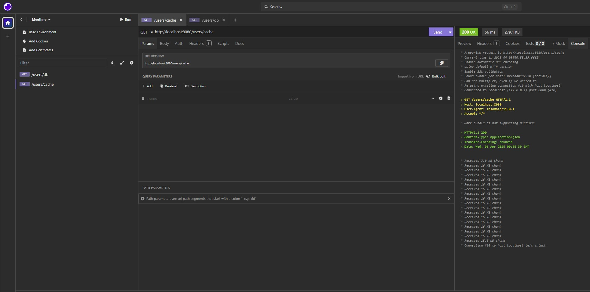
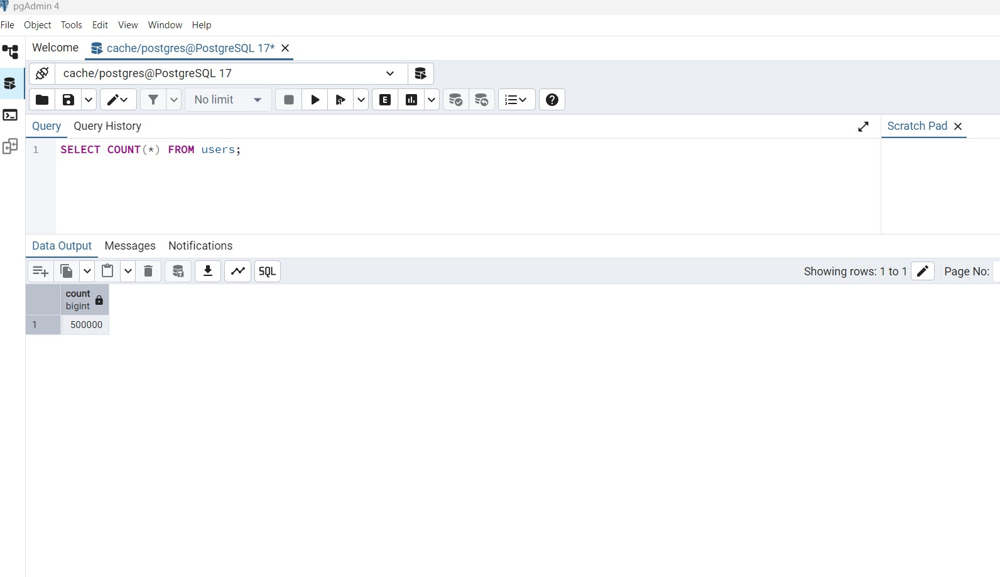

# 🚀 Spring Boot API com Redis Cache

Esta aplicação demonstra o uso de **cache com Redis** integrado a uma API construída com **Spring Boot**, visando **reduzir a latência** de acesso ao banco de dados PostgreSQL e otimizar a performance geral do sistema.

---

## 📊 Resultados de Performance

Ao comparar o tempo de resposta entre chamadas diretas ao banco de dados e chamadas com uso de cache Redis, obtivemos os seguintes ganhos:

| Tipo de Requisição       | Tempo Médio (ms) |
|--------------------------|------------------|
| Banco de Dados (Postgres)| ~350ms           |
| Cache Redis              | ~4ms             |

**✅ Redução de ~98% no tempo de resposta** para consultas com cache ativo.

---

## 🛠️ Tecnologias Utilizadas

- **Java 17**
- **Spring Boot 3**
    - Spring Web
    - Spring Data JPA
    - Spring Cache
- **Redis** (via Docker)
- **PostgreSQL**
- **MapStruct** (DTO ↔ Entity mapping)
- **Lombok**
- **JUnit 5 & Mockito** (testes unitários)
- **Docker & Docker Compose**
- **Apache Kafka** (em preparação para integração de eventos)
- **Observabilidade:** Spring Boot Actuator & Logs detalhados (SQL, tempo de execução)

---

## 📦 Arquitetura

## 📦 Arquitetura

```text
                    +------------------+
                    |   Client/API     |
                    +------------------+
                             |
                             v
                     +---------------+
                     |   Controller  |
                     +---------------+
                             |
                             v
                     +---------------+
                     |    Service    |
                     +---------------+
                       |          |
        +------------------+   +------------------+
        | Redis (Cache Hit) |   | Postgres (DB Hit)|
        +------------------+   +------------------+
                                      |
                                      v
                             +------------------+
                             | Atualiza o Cache |
                             +------------------+
```

Primeiro tenta recuperar os dados do Redis.

Se não encontrar (cache miss), busca no PostgreSQL.

Após consulta, atualiza o cache Redis para próximas requisições.

## ⚙️ Execução com Docker

### Certifique-se de ter Docker e Docker Compose instalados.

Subir os containers (Redis, Kafka, Zookeeper):

docker-compose up -d


### Verifique se os serviços estão rodando:

docker ps

## ▶️ Rodando a aplicação

### Configure seu banco local (PostgreSQL) com usuário postgres, senha root e banco cache, ou ajuste no 

application.properties.

### Execute a aplicação:

./mvnw spring-boot:run

Acesse os endpoints via http://localhost:8080

## Telas da aplicação


🟢 Primeira requisição ao Banco de Dados



🟢 Primeira requisição ao Redis Cache



🔁 Segunda requisição ao Banco de Dados



🔁 Segunda requisição ao Redis Cache



🗃️ Consulta direta ao PostgreSQL

